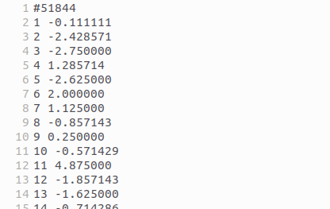

# Pulsar Nulling Fraction Calculator

A tool for measuring the **nulling fraction** of radio pulsars from single-pulse data. Nulling is a phenomenon where a pulsar intermittently switches its radio emission off for one or more pulse periods. This code measures what fraction of pulses are "nulls" using two independent methods, described in detail in Brook et al. (2026):

1. **Histogram Scaling (HS) method** (§3.2) — For each observation, separate histograms of the on-pulse and off-pulse total flux densities are constructed. A scaled copy of the off-pulse histogram is subtracted from the on-pulse histogram, with the scale factor chosen so that the sum of difference counts in bins with flux density below zero is minimised to zero (i.e. no excess of apparent nulls). The nulling fraction is then simply this scale factor, with a fitting uncertainty of √n_p / N, where n_p = NF × N is the number of null pulses and N is the total number of rotations. A limitation of this method is the assumption that all pulses with negative flux density are genuine nulls; in low-S/N data, non-null pulses can scatter below zero, leading to a potential underestimate of the nulling fraction.

2. **Bayesian Parameter Estimation (BPE) method** (§3.3) — For each observation, a histogram of summed on-pulse window flux densities is modelled as a mixture of two components: a Gaussian (representing null pulses, whose mean is fixed to the off-pulse noise level) and a log-normal (representing the energy distribution of non-null emission pulses). Markov chain Monte Carlo (MCMC) sampling is used to explore the joint posterior distribution over the log-normal parameters (μ and σ) and the nulling fraction. The reported NF and its 1σ uncertainty are the median and standard deviation of the marginalised posterior. This method is more robust at low S/N than the HS method because it explicitly accounts for noise broadening the null distribution.

## Requirements

- Python 3.x
- Dependencies listed in `requirements.txt`: `numpy`, `scipy`, `matplotlib`, `emcee`, `corner`

## Installation

```bash
python3 -m venv .venv
source .venv/bin/activate
pip install -r requirements.txt
```

## Running with the example data

Example data for pulsar **J1559-5545** is included in `pulsar_data/J1559-5545/`. A ready-made bash script is provided to run the calculator on this data:

```bash
bash bash_script/nf_calculator_J1559-5545.sh
```

This is equivalent to running:

```bash
python python_code/nf_calculator.py \
    -pulsar J1559-5545 \
    -fb 114 \
    -lb 139 \
    -outdir pulsar_results/ \
    -datadir pulsar_data/
```

Results and plots will be written to `pulsar_results/J1559-5545/`.

## Arguments

| Argument   | Description                                           | Example         |
|------------|-------------------------------------------------------|-----------------|
| `-pulsar`  | Pulsar name (must match the subdirectory in datadir)  | `J1559-5545`    |
| `-fb`      | First phase bin of the on-pulse window                | `114`           |
| `-lb`      | Last phase bin of the on-pulse window                 | `139`           |
| `-outdir`  | Directory where output plots and files are saved      | `pulsar_results/` |
| `-datadir` | Directory containing the pulsar data subdirectories   | `pulsar_data/`  |

## Input data format

Each observation is a plain ASCII text file. Files can have any name and should be placed in `pulsar_data/<pulsar_name>/`.

The first line must be the Modified Julian Date (MJD) of the observation, prefixed with `#`:

```
#51844
```

The remaining lines are two-column rows giving the phase bin number and flux density for every pulse in the observation. Each pulse occupies exactly `N` rows (where `N` is the number of phase bins, set via `-bins`), with bin numbers running from 1 to N, then repeating for the next pulse:

```
#51844
1 -0.111111
2 -2.428571
3 -2.750000
...
512 -0.714286
1 0.482143
2 1.625000
...
```



All files in `pulsar_data/<pulsar_name>/` are processed, so ensure the directory contains only observation data files.

## Reproducibility

The Histogram Scaling method is fully deterministic. The Bayesian method uses MCMC (`emcee`) and is stochastic: walker starting positions are randomly perturbed and the sampler draws different chains each run, so the Bayesian nulling fraction and its uncertainties will vary slightly between runs. With the default settings (100 burn-in steps, 1000 sample steps, 10 walkers) this variation is typically small, but to get exactly reproducible results you can add `np.random.seed(<integer>)` near the top of `nf_calculator.py` before the MCMC section.

## Outputs

### Per-observation diagnostic plots

For each observation file, seven diagnostic plots are saved to `<outdir>/<pulsar_name>/`:

**`*_waterfall_mean.png`** — Two-panel figure. The upper panel is a waterfall plot showing the flux density of every individual pulse as a function of phase bin (x-axis) and pulse number (y-axis), giving a visual overview of the nulling behaviour across the observation. The lower panel shows the normalised mean pulse profile, with green dashed lines marking the on-pulse window and orange dashed lines marking the off-pulse window used for baseline estimation.

**`*_flux.png`** — Scatter plot of the summed on-pulse window flux density for each individual pulse, plotted against pulse number. Useful for seeing the variability of emission from pulse to pulse and identifying extended null or burst periods.


**`*_hist_before.png`** — Overlapping histograms of the on-pulse (green) and off-pulse (orange) flux density distributions before any scaling is applied. Shows the raw separation between the null and emission populations.


**`*_hist_neg.png`** — Histograms showing only the negative flux density values from the on-pulse (green) and off-pulse (orange) windows. This is the input used by the Histogram Scaling method — the scale factor is found by matching these negative tails.


**`*_hist_scaled.png`** — Histograms after the HS scaling factor has been applied to the on-pulse data. The negative tails of the two distributions are aligned, demonstrating the fit and the derived nulling fraction.


**`*_bayes_fit.png`** — Histogram of on-pulse window flux density with the BPE model overlaid. The blue curve is the null component (Gaussian noise), the red curve is the emission component (lognormal convolved with the noise distribution), and the dashed black curve is their sum. A good fit indicates the MCMC has converged on a physically reasonable solution.


**`*_corner_plot.png`** — MCMC posterior corner plot showing the joint and marginal distributions of the three fitted parameters: number of nulls, μ (lognormal mean of the emission component), and σ (lognormal width). Used to assess sampler convergence and correlations between parameters.


### Summary output files

**`<outdir>/<pulsar>/<pulsar>.txt`** — one row per quantity, one column per observation (sorted chronologically by MJD):

| Row | Quantity | Description |
|-----|----------|-------------|
| 1 | MJD | Modified Julian Date of the observation |
| 2 | Bayesian NF | Bayesian nulling fraction (posterior median) |
| 3 | NF lower uncertainty | Lower uncertainty on the Bayesian NF |
| 4 | NF upper uncertainty | Upper uncertainty on the Bayesian NF |
| 5 | S/N proxy | Signal-to-noise proxy for the observation |
| 6 | Number of profiles | Number of single pulses in the observation |
| 7 | HS NF | Histogram Scaling nulling fraction |
| 8 | Max consecutive nulls | Longest consecutive null run in the observation |

**`<outdir>/<pulsar>/<pulsar>_consecutive_nulls_and_non.txt`** — null and non-null run lengths

## Visualising NF evolution: `plot_nf_evolution.ipynb`

After running `nf_calculator.py` across all observations of a pulsar, the Jupyter notebook `plot_nf_evolution.ipynb` reads the summary outputs and produces a single diagnostic figure showing how the nulling fraction evolves over time.

Set the pulsar name and results directory at the top of the notebook:

```python
pulsar_name = 'J1559-5545'
data_dir    = 'pulsar_results'
```

The notebook then:

1. Loads the per-observation NFs, uncertainties, S/N proxies, and rotation counts from `<data_dir>/<pulsar_name>/<pulsar_name>.txt`, along with the null and non-null run-length lists.
2. Combines the Bayesian measurement uncertainty with a binomial sampling uncertainty (estimated from the mean null/non-null train length) to produce total per-observation error bars for both the BPE and HS methods.
3. Fits a weighted linear model (via `scipy.optimize.curve_fit`) to the NF time series for each method, and computes a covariance-based 2σ confidence band on the best-fit line.
4. Produces a four-panel figure saved as `<pulsar_name>_main_nf_evolution_start.png`:

| Panel | Content |
|-------|---------|
| Top | Number of pulse rotations per observation |
| Second | S/N proxy per observation |
| Third | BPE nulling fraction vs. time, with linear fit and 2σ band |
| Bottom | HS nulling fraction vs. time, with linear fit and 2σ band |

The x-axis shows Modified Julian Date (bottom) and calendar year (top). The red shaded region in each NF panel is the 2σ confidence band derived from the parameter covariance matrix of the linear fit.
