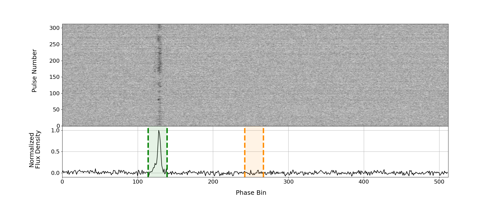
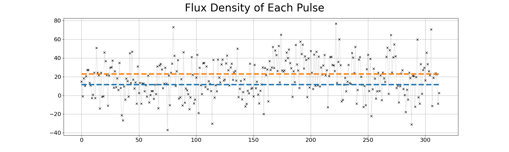
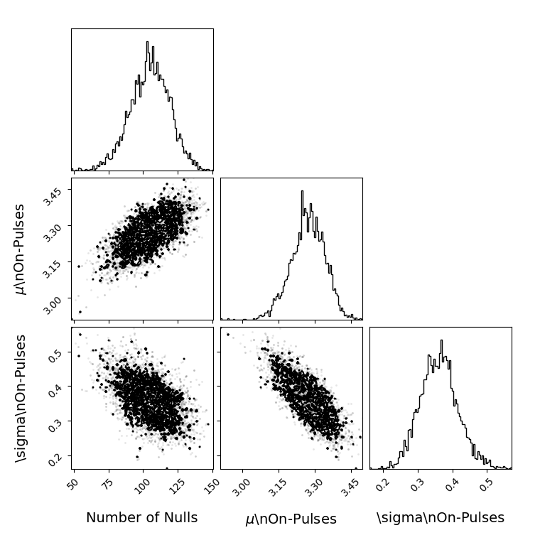
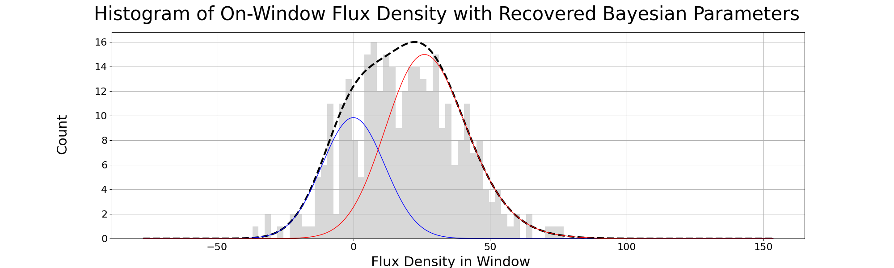
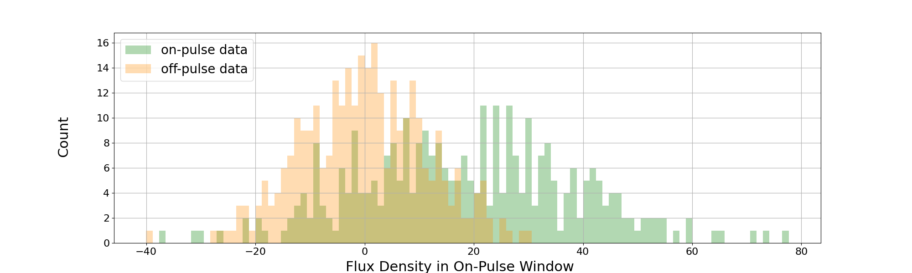
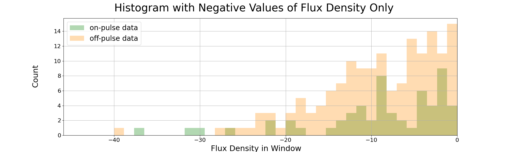
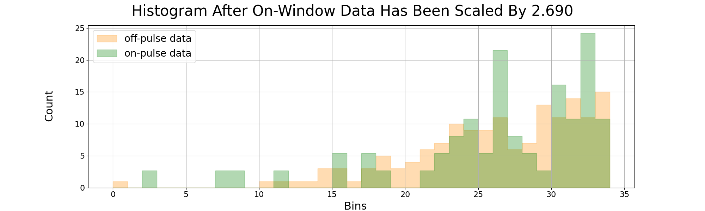
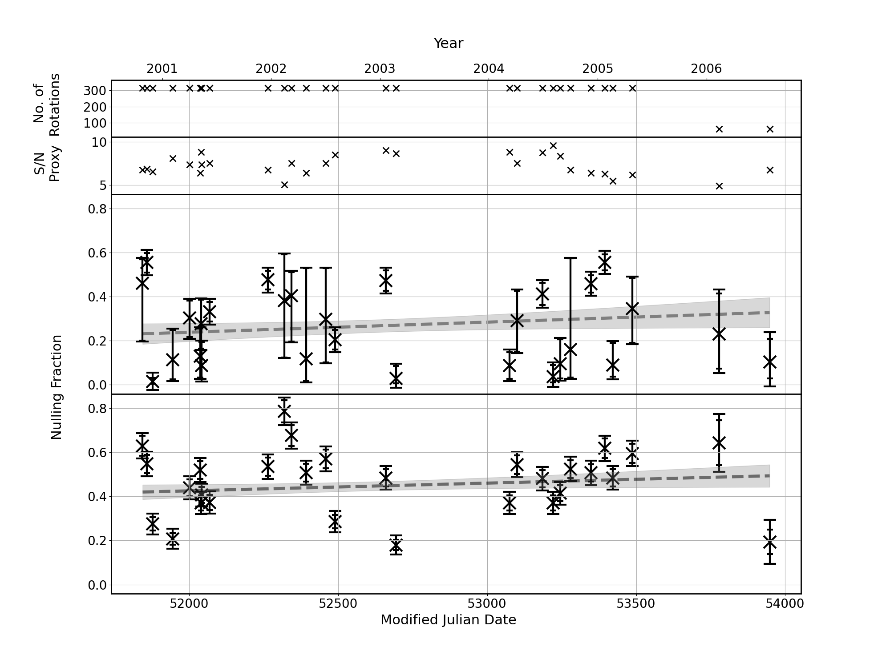

# Pulsar Nulling Fraction Calculator

A tool for measuring the **nulling fraction** of radio pulsars from single-pulse data. Nulling is a phenomenon where a pulsar intermittently switches its radio emission off for one or more pulse periods. This code measures what fraction of pulses are "nulls" using two independent methods, described in detail in [Brook et al. (2026)](https://arxiv.org/abs/2602.22956):

1. **Histogram Scaling (HS) method** (§3.2) — For each observation, separate histograms of the on-pulse and off-pulse total flux densities are constructed. A scaled copy of the off-pulse histogram is subtracted from the on-pulse histogram, with the scale factor chosen so that the sum of difference counts in bins with flux density below zero is minimised to zero (i.e. no excess of apparent nulls). The nulling fraction is then simply this scale factor, with a fitting uncertainty of √n_p / N, where n_p = NF × N is the number of null pulses and N is the total number of rotations. A limitation of this method is the assumption that all pulses with negative flux density are genuine nulls; in low-S/N data, non-null pulses can scatter below zero, leading to a potential underestimate of the nulling fraction.

2. **Bayesian Parameter Estimation (BPE) method** (§3.3) — For each observation, a histogram of summed on-pulse window flux densities is modelled as a mixture of two components: a Gaussian (representing null pulses, whose mean is fixed to the off-pulse noise level) and a log-normal (representing the energy distribution of non-null emission pulses). Markov chain Monte Carlo (MCMC) sampling is used to explore the joint posterior distribution over the log-normal parameters (μ and σ) and the nulling fraction. The reported NF and its 1σ uncertainty are the median and standard deviation of the marginalised posterior. This method is more robust at low S/N than the HS method because it explicitly accounts for noise broadening the null distribution.

## Requirements

- Python 3.x
- Dependencies listed in `requirements.txt`: `numpy`, `scipy`, `matplotlib`, `emcee`, `corner`

## Installation

```bash
python3 -m venv .venv
source .venv/bin/activate
pip install -r requirements.txt
```

## Running with the example data

Example data for pulsar **J1559-5545** is included in `pulsar_data/J1559-5545/`. A ready-made bash script is provided to run the calculator on this data:

```bash
bash bash_script/nf_calculator_J1559-5545.sh
```

This is equivalent to running:

```bash
python python_code/nf_calculator.py \
    -pulsar J1559-5545 \
    -fb 114 \
    -lb 139 \
    -outdir pulsar_results/ \
    -datadir pulsar_data/
```

Results and plots will be written to `pulsar_results/J1559-5545/`.

## Arguments

| Argument   | Description                                           | Example         |
|------------|-------------------------------------------------------|-----------------|
| `-pulsar`  | Pulsar name (must match the subdirectory in datadir)  | `J1559-5545`    |
| `-fb`      | First phase bin of the on-pulse window                | `114`           |
| `-lb`      | Last phase bin of the on-pulse window                 | `139`           |
| `-outdir`  | Directory where output plots and files are saved      | `pulsar_results/` |
| `-datadir` | Directory containing the pulsar data subdirectories   | `pulsar_data/`  |

## On-pulse and off-pulse windows

The on-pulse and off-pulse windows are the two most important parameters to set correctly, as everything in the analysis depends on them.

Each pulse period is divided into phase bins (e.g. 512 bins covering one full rotation). The pulsar's radio emission only appears in a small range of these bins — the **on-pulse window**, defined by `-fb` (first bin) and `-lb` (last bin). The total flux density summed across these bins for each pulse is the quantity used to measure the nulling fraction. You should inspect the mean pulse profile (visible in `*_waterfall_mean.png`) and choose `-fb` and `-lb` to tightly bracket the emission peak.

The **off-pulse window** is a region of the same width as the on-pulse window, placed a quarter of a period away (i.e. starting at bin `-fb + N/4`, where N is the total number of bins). This region should contain no real emission and is used to characterise the baseline radiometer noise. It provides the reference noise distribution that both the HS and BPE methods use to identify null pulses. The off-pulse window is set automatically by the code — you do not need to specify it.

The green dashed lines in the `*_waterfall_mean.png` plot mark the on-pulse window, and the orange dashed lines mark the off-pulse window, so you can verify both are positioned correctly.

## Input data format

Each observation is a plain ASCII text file. Files can have any name and should be placed in `pulsar_data/<pulsar_name>/`.

The first line must be the Modified Julian Date (MJD) of the observation, prefixed with `#`:

```
#51844
```

The remaining lines are two-column rows giving the phase bin number and flux density for every pulse in the observation. Each pulse occupies exactly `N` rows (where `N` is the number of phase bins, set via `-bins`), with bin numbers running from 1 to N, then repeating for the next pulse:

```
#51844
1 -0.111111
2 -2.428571
3 -2.750000
...
512 -0.714286
1 0.482143
2 1.625000
...
```

All files in `pulsar_data/<pulsar_name>/` are processed, so ensure the directory contains only observation data files.

## Reproducibility

The Histogram Scaling method is fully deterministic. The Bayesian method uses MCMC (`emcee`) and is stochastic: walker starting positions are randomly perturbed and the sampler draws different chains each run, so the Bayesian nulling fraction and its uncertainties will vary slightly between runs. With the default settings (100 burn-in steps, 1000 sample steps, 10 walkers) this variation is typically small, but to get exactly reproducible results you can add `np.random.seed(<integer>)` near the top of `nf_calculator.py` before the MCMC section.

## Outputs

### Per-observation diagnostic plots

For each observation file, seven diagnostic plots are saved to `<outdir>/<pulsar_name>/`:

**`*_waterfall_mean.png`** — Two-panel figure. The upper panel is a waterfall plot showing the flux density of every individual pulse as a function of phase bin (x-axis) and pulse number (y-axis), giving a visual overview of the nulling behaviour across the observation. The lower panel shows the normalised mean pulse profile, with green dashed lines marking the on-pulse window and orange dashed lines marking the off-pulse window used for baseline estimation.



**`*_flux.png`** — Scatter plot of the summed on-pulse window flux density for each individual pulse, plotted against pulse number. Useful for seeing the variability of emission from pulse to pulse and identifying extended null or burst periods. The blue dashed line marks the mean off-pulse flux density plus 1 standard deviation, used as the threshold for classifying a pulse as a null or an emission. The orange dashed line marks the mean plus 2 standard deviations, indicating more confidently detected emission pulses.



**`*_corner_plot.png`** — MCMC posterior corner plot showing the joint and marginal distributions of the three fitted parameters: the number of null pulses, μ (the mean of the natural logarithm of the on-pulse flux densities for non-null pulses — i.e. the location parameter of the lognormal distribution), and σ (the standard deviation of the natural logarithm of the on-pulse flux densities for non-null pulses — i.e. the width of the lognormal distribution). Narrow, well-separated posteriors indicate a reliable fit; broad or multimodal distributions suggest the data quality or nulling fraction may make the parameters hard to constrain.



**`*_bayes_fit.png`** — Histogram of on-pulse window flux density with the BPE model overlaid. The blue curve is the null component (Gaussian noise), the red curve is the emission component (lognormal convolved with the noise distribution), and the dashed black curve is their sum. A good fit indicates the MCMC has converged on a physically reasonable solution.



**`*_hist_before.png`** — Overlapping histograms of the on-pulse (green) and off-pulse (orange) flux density distributions before any scaling is applied. Shows the raw separation between the null and emission populations.



**`*_hist_neg.png`** — Histograms showing only the negative flux density values from the on-pulse (green) and off-pulse (orange) windows. This is the input used by the Histogram Scaling method — the scale factor is found by matching these negative tails.



**`*_hist_scaled.png`** — Histograms after the HS scaling factor has been applied to the on-pulse data. The negative tails of the two distributions are aligned, demonstrating the fit and the derived nulling fraction.



### Summary output files

**`<outdir>/<pulsar>/<pulsar>.txt`** — This is the main results file. It contains one row per quantity and one column per observation, sorted chronologically by MJD. Each column therefore represents one observation, and each row represents a different measured quantity. This file is read directly by `plot_nf_evolution.ipynb` to produce the NF evolution plot.

| Row | Quantity | Description |
|-----|----------|-------------|
| 1 | MJD | Modified Julian Date of the observation |
| 2 | BPE nulling fraction | The nulling fraction measured by the Bayesian Parameter Estimation method — the fraction of pulses that are nulls, as the median of the MCMC posterior distribution. A value of 0 means no nulling was detected; a value of 1 means the pulsar was nulling for the entire observation. |
| 3 | BPE lower uncertainty | The downward 1σ uncertainty on the BPE nulling fraction, combining the MCMC fitting uncertainty and the binomial sampling uncertainty. |
| 4 | BPE upper uncertainty | The upward 1σ uncertainty on the BPE nulling fraction, combining the MCMC fitting uncertainty and the binomial sampling uncertainty. |
| 5 | S/N proxy | A signal-to-noise proxy for the observation, estimated as the median peak flux density of the brightest non-null pulses. A useful indicator of data quality — low values suggest the observation may be too noisy for reliable NF measurement. |
| 6 | Number of profiles | The total number of individual pulses (rotations) in the observation. |
| 7 | HS nulling fraction | The nulling fraction measured by the Histogram Scaling method. |
| 8 | Max consecutive nulls | The longest consecutive run of null pulses found in the observation. |

**`<outdir>/<pulsar>/<pulsar>_consecutive_nulls_and_non.txt`** — Two lines listing the lengths of every consecutive null train and every consecutive emission train across all observations. Used internally by `plot_nf_evolution.ipynb` to estimate the binomial sampling uncertainty.

## Visualising NF evolution: `plot_nf_evolution.ipynb`

After running `nf_calculator.py` across all observations of a pulsar, the Jupyter notebook `plot_nf_evolution.ipynb` reads the summary outputs and produces a single diagnostic figure showing how the nulling fraction evolves over time.

Open the notebook with:

```bash
jupyter lab plot_nf_evolution.ipynb
```

Set the pulsar name and results directory at the top of the notebook:

```python
pulsar_name = 'J1559-5545'
data_dir    = 'pulsar_results'
```

The notebook then:

1. Loads the per-observation NFs, uncertainties, S/N proxies, and rotation counts from `<data_dir>/<pulsar_name>/<pulsar_name>.txt`, along with the null and non-null run-length lists.
2. Combines the Bayesian measurement uncertainty with a binomial sampling uncertainty (estimated from the mean null/non-null train length) to produce total per-observation error bars for both the BPE and HS methods.
3. Fits a weighted linear model (via `scipy.optimize.curve_fit`) to the NF time series for each method, and computes a covariance-based 2σ confidence band on the best-fit line.
4. Produces a four-panel figure saved as `<pulsar_name>_main_nf_evolution_start.png`:

| Panel | Content |
|-------|---------|
| Top | Number of pulse rotations per observation |
| Second | S/N proxy per observation |
| Third | BPE nulling fraction vs. time, with linear fit and 2σ band |
| Bottom | HS nulling fraction vs. time, with linear fit and 2σ band |

The x-axis shows Modified Julian Date (bottom) and calendar year (top). The grey shaded region in each NF panel is the 2σ confidence band derived from the parameter covariance matrix of the linear fit.

**Example output for J1559-5545:**



The four panels show (top to bottom):

- **No. of Rotations** — the number of individual pulses in each observation. Variations here reflect different observation lengths and help flag whether data quality differences may be driving apparent NF changes.
- **S/N Proxy** — a signal-to-noise proxy (median peak flux density of the brightest non-null pulses) per observation. Low values indicate noisy observations where NF measurements are less reliable.
- **Nulling Fraction (Bayesian / BPE method)** — the nulling fraction per observation measured by the Bayesian Parameter Estimation method, with combined measurement and binomial uncertainties shown as error bars. The dashed line is the weighted linear best fit; the grey band is the 2σ covariance-based confidence interval on that fit.
- **Nulling Fraction (Histogram Scaling method)** — the same time series measured independently using the Histogram Scaling method. Comparing the two panels gives a sense of how consistent the two estimators are across the observing campaign.

> **Note:** J1559-5545 was one of the pulsars analysed in [Brook et al. (2026)](https://arxiv.org/abs/2602.22956). The plot above looks different from the figure in that paper because the observations for this pulsar had baseline stability issues that required additional pre-processing before the analysis. The data included here has not had that extra processing applied, so this example is intended purely to demonstrate how the code works rather than to reproduce the published result.

## Limitations

The following limitations are discussed in detail in §7 of [Brook et al. (2026)](https://arxiv.org/abs/2602.22956) and apply to both the HS and BPE methods implemented here.

**Pulse-profile baseline stability.** Both methods assume a stable, flat baseline within each observation. Noise or instrumental effects that corrupt the baseline — producing a non-Gaussian or offset background — can introduce systematic errors in the inferred NF. Additional baseline-flattening steps beyond standard processing risk distorting the noise statistics and biasing the histograms rather than improving them.

**HS method: sensitivity to negative-tail distortions.** The Histogram Scaling method infers the NF entirely from the negative-flux tail of the on-pulse histogram. Any distortion of the on-pulse noise distribution — whether an excess or a deficit of negative-flux values — directly biases the HS result. The BPE method is considerably more robust to such distortions because it models the full on-pulse flux-density distribution, not just the negative tail.

**Nulls must resemble off-pulse noise.** Both methods operate under the assumption that null pulses within the on-pulse window are statistically indistinguishable from the off-pulse noise. If the emission in the on-pulse window merely drops to a low level rather than switching fully off, the inferred NF will be inaccurate. The validity of this assumption should be checked by inspecting the `*_hist_before.png` and `*_bayes_fit.png` diagnostics.

**Multiple or partial emission components.** If the on-pulse window contains multiple overlapping emission components (e.g. a pulsar with a complex profile), or if only part of the profile nulls rather than the entire emission feature, neither method is optimal. In such cases, the NF reported may reflect the behaviour of one component within the window rather than true whole-pulse nulling.

**BPE method: lognormal emission assumption.** The BPE method models the energy distribution of non-null emission pulses as a lognormal distribution. If the true energy distribution deviates significantly from lognormal — for example in pulsars with unusual emission statistics — the reliability of the BPE NF and its uncertainties may be reduced.

**Low S/N observations.** At low signal-to-noise, emission pulses scatter into the noise and become difficult to distinguish from nulls. Applied to a genuinely non-nulling pulsar observed at low S/N, both methods can return a spuriously non-zero NF. The S/N proxy in the summary output file (row 5) provides a useful indicator of data quality for each observation.

**Interpreting long-term NF gradients.** When using the notebook to fit a linear trend to NF over time, the formal uncertainties on the slope may underestimate the true error budget. Inferred gradients can be sensitive to methodological choices, baseline stability, and modest differences in a small number of individual measurements. Evidence for long-term NF evolution should therefore be treated as tentative unless confirmed across multiple epochs and both estimation methods.
